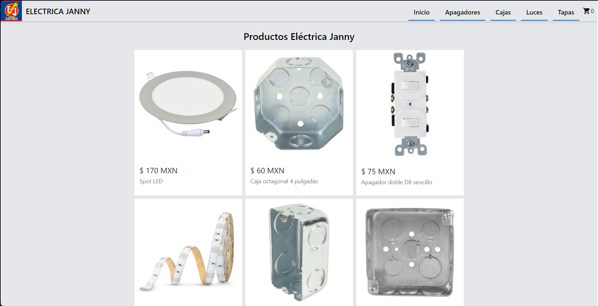

# E-commerce Eléctrica Janny

## Curso CoderHouse #49965

## Sitio Web

[Eléctrica Janny E-commerce](https://danielherrera24.github.io/e-commerce-react/)

## Dependencias:

* React + Create React App
* Firebase
* TailwindCSS
* SweetAlert2
* MUI

## Contenido:

Dentro de este E-commerce puedes encontrar algunos productos, los cuales puedes buscarlos por categorías desde la barra de navegación, así como el botón que dirije al carrito.

Al dar click en un producto se puede ver el detalle y posibilidad de agregar al carrito, el cual mostrará todos los productos agregados y la cantidad total a pagar.

Para simular la compra, al dar click en "Comprar ahora" llevará a un formulario, al llenarlo y realizando la compra se mostrará un ID de la orden.

---

### Encuéntrame en [LinkedIn](https://www.linkedin.com/in/daniel-herrera-02314b279/) como Daniel Herrera.
